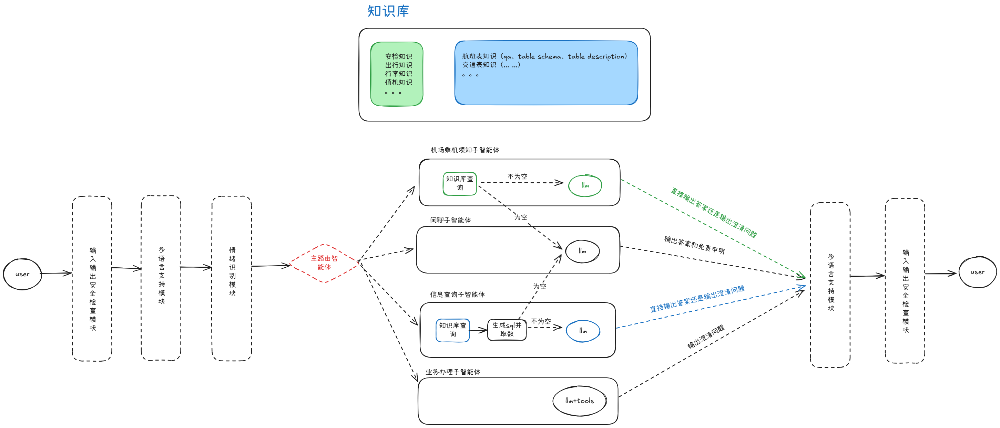
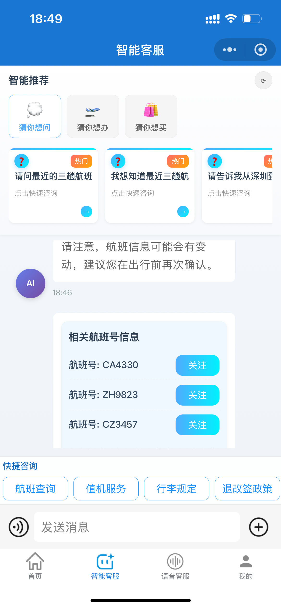
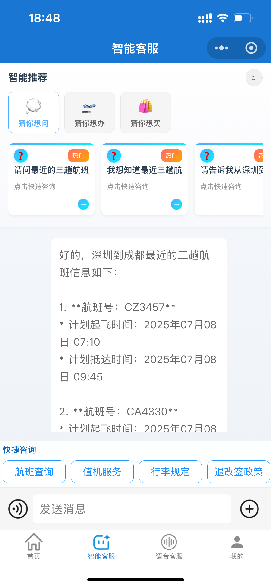
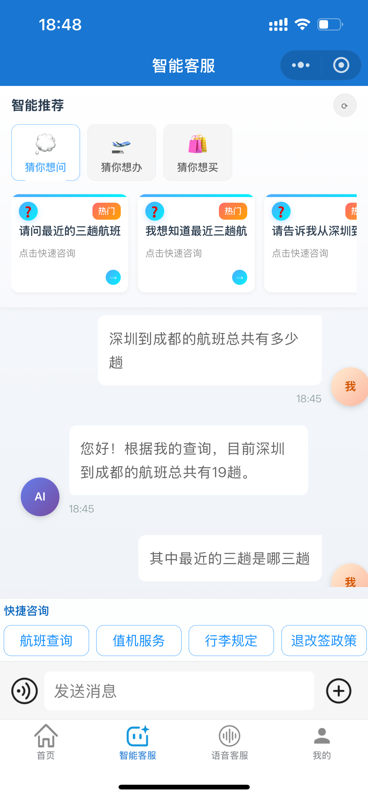
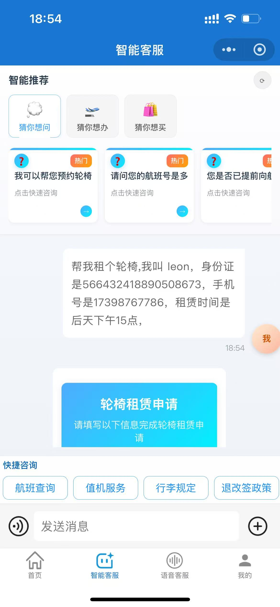
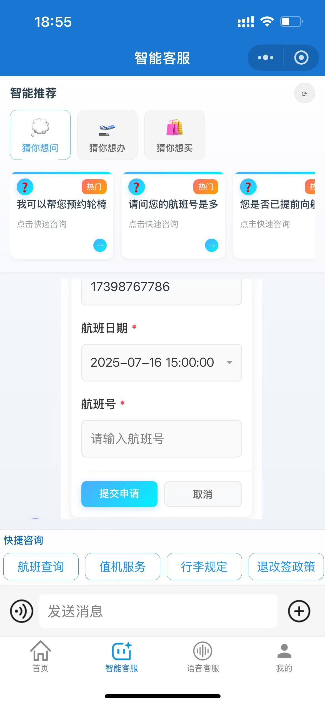
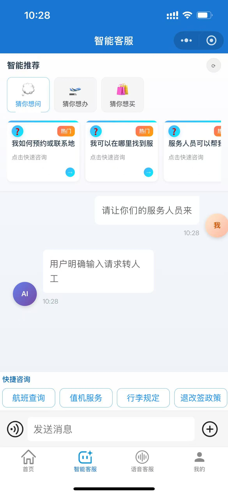
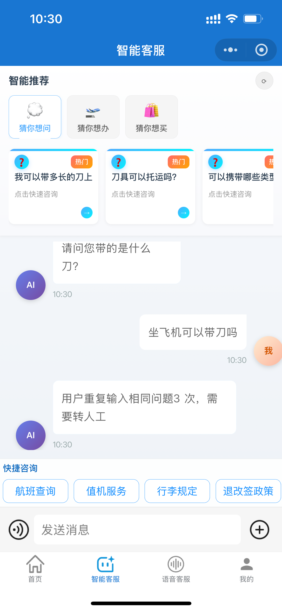
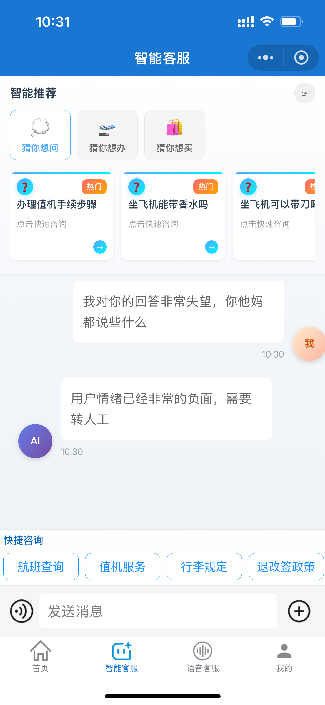
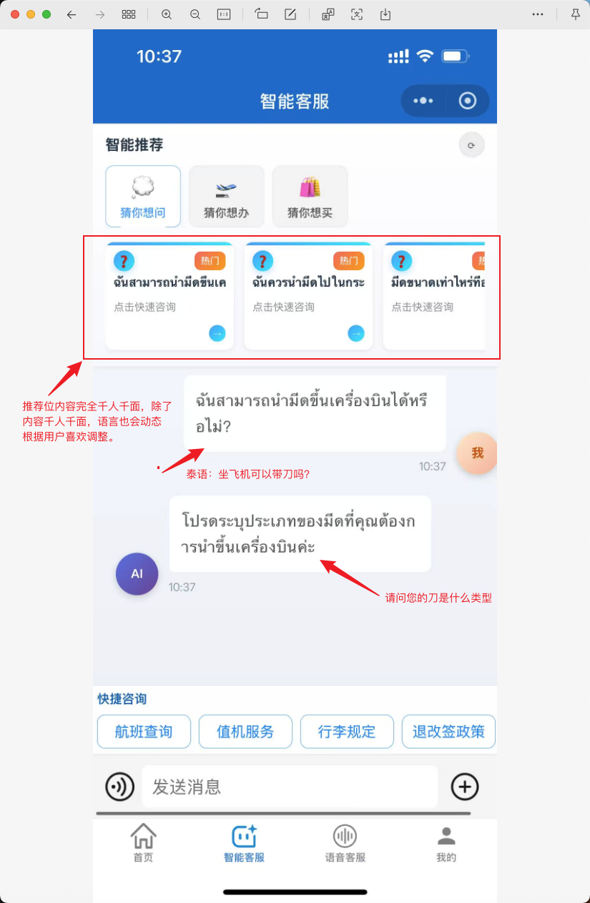

# 智能机场客服系统

## 📝 项目概述

智能机场客服系统是一个基于LangGraph+mcp构建的智能问答系统，专门为机场设计。               
技术上：系统采用多智能体协作架构，通过意图分类器将用户请求智能路由到不同的子智能体。由专业的子智能体来精准回答用户问题。              
业务上：系统主要提供四大类服务：           
1. 乘机须知问答，包括安检须知、联检(边检、海关、检疫)须知、出行须知（订票（改签）、值机、登机、中转、出发、到达、行李、证件）等；             
2. 信息查询（包括航班状态、时刻表等）；            
3. 业务办理（包括行李寄存、航班改签等）            
4. 以及闲聊。            
整体系统支持多轮对话，能够根据上下文理解用户意图，并通过知识库检索和数据库查询为用户提供准确、及时的信息服务。            

## 智能客服的当前困境与挑战
在大语言模型（LLM）浪潮下，各行各业都在尝试用 AI 升级客服系统。然而，通往真正“智能”的道路上充满了挑战和困境，这些困境既是技术的，也是思想和商业上的。我们的项目正是为了直面并尝试突破这些困境而设计的。

困境一：“AGI 幻觉”——来自外界的过度期望
许多非技术背景的决策者或高管，在见证了通用大模型的强大能力后，容易对 AI 产生一种“通用人工智能（AGI）”的幻觉。他们期望的“智能客服”不仅能处理业务，还要无所不知、无所不能，像一个拥有完整心智的智慧体。这种过度期望导致项目目标与技术现实严重脱节，给开发团队带来了巨大的压力。智能客服的本质应是“领域专家”，而非“通用智者”，如何在有限的技术边界内，管理并满足合理的业务期望，是第一个巨大挑战。

困境二：“新瓶装旧酒”——技术惯性下的架构束缚
当前市场上的许多“智能客服”产品，并非革命性的创新，而是“演进式”的改良。它们大多沿袭了 1.0 时代的“画布（Canvas）+ 规则/小模型”架构，仅仅是将“小模型”替换为“大模型”。这种模式就像给一辆旧马车换上了喷气式发动机，虽然动力强了，但马车的结构从根本上限制了速度和灵活性。LLM 强大的上下文理解、推理和规划能力，被死板的、预设的流程画布牢牢束缚，无法真正发挥其潜力，导致系统依然脆弱、难以维护且不够智能。

困境三：“成熟范式的引力”——商业现实与创新阻力
“画布+模型”的产品形态经过多年发展，已经形成了一套成熟的商业模式和生态系统。对于服务商而言，这套范式易于销售、易于交付、易于培训客户。彻底抛弃它，转向一种全新的、以智能体（Agent）协作为核心的架构，无异于一场“推倒重来”的革命。这不仅意味着巨大的研发投入和风险，更挑战了现有的商业模式。因此，许多厂商宁愿在旧范式上修修补补，也不愿迈出真正变革的一步。这种商业上的惯性，成为了智能客服领域创新的最大阻力。

困境四：智能客服不是一次建成就结束，他和传统AI 算法一样，效果会衰减，而要长期运营客服系统，需要的是一个全面的运营指标体系，能够提供离线、在线的实时监测和评估，保证系统上线迭代时有理可依、保证系统走差时能够及时接入，而这也是当下所欠缺的。

我们的智能机场客服系统，正是为了直面并尝试解决这些困境而生。我们相信，基于智能体（Agent）协作的架构，而非固化的流程画布，才是释放大模型潜能、构建下一代智能客服的关键路径。同时以共生陪伴的概念，建立全方位的指标体系（业务指标+技术指标），对整体系统的端到端评测、对组件级的评测。保证系统健康运行，越用越好。

## 目录
- [📝 项目概述](#-项目概述)
- [🏗️ 系统架构](#️-系统架构)
  - [🛠️ 技术栈](#️-技术栈)
- [✨ 功能亮点](#-功能亮点)
  - [现有基于大模型的客服系统的问题分析](#现有基于大模型的客服系统的问题分析)
  - [我们的智能客服系统的两点](#我们的智能客服系统的两点)
- [🚀产品功能展示](#🚀产品功能展示)
- [🎯 下一步计划 ](#下一步计划 )
- [🚀 快速开始](#-快速开始)
  - [环境要求](#环境要求)
  - [安装步骤](#安装步骤)
  - [运行系统](#运行系统)
- [🤝 贡献指南](#-贡献指南)
- [📜 许可证](#-许可证)

## 🏗️ 系统架构

系统基于LangGraph构建，采用图形化工作流结构，主要结构如下：


### 🛠️ 技术栈
- **ragflow**:ragflow提供了一个很好是知识库管理平台，所以本项目的知识管理部分，依托于 ragflow（用户需自行下载）
- **xinference**:xinference 提供了一个模型的全生命周期的管理，所以关于本项目用到的情感识别模型、embedding 模型，以及后期的本地化大模型都采用 xinference 来部署（用户需自行下载）。
- **LangGraph**: 构建工作流和状态管理，本项目的智能体和对话管理部分几乎都是依赖于 langgraph。
- **LangChain**: 基础组件库
- **MCP**: 以mcp技术弹性接入第三方服务，诸如高德mcp server，12306mcp servser

## ✨ 功能亮点
### 现有基于大模型的客服系统的问题分析
1. 总是以被动式的形式提供服务，用户问一个问题，智能客服回答一个问题。被动式的回答总是给人心理感觉还是个机器；
2. 回答的答案太过长篇大论，智能客服回答的答案虽然能解决用户问题，但是篇幅通常过长、内容需要用户进行阅读和理解；
3. 非个性化回答，任何人问同一个问题，答案都几乎一样，这是现有智能客服的范式导致。回答的答案不会考虑用户的历史画像。

### 我们的智能客服系统的两点
1. 主动+被动的形式来提供服务：当用户问题和知识库答案粒度不匹配时，智能客服会选择生成一个问题，要求用户澄清，如果匹配，则生成答案。这让用户从心理上感觉智能客服更新一个人。
2. 超短的答案回复，第一点的描述中，实现了一个漏斗式的问答交互，通过不断的问题澄清和追问，实现了主动的心理感受之外，也附带的实现了让每一次的回复都足够的短和精准。省去了用户的长时间理解，同时也给实时的语音交互和实时电话的接入提供了技术支持。
3. 个性化的问答：整个客服系统会通过历史咨询的历史来沉淀出用户画像，回答时会跟进用户画像实现个性化服务；
4. 闭环系统优化：系统设计了一个强大的记忆模块：可沉淀：用户画像、事实记忆、情景记忆等内容。反哺现有知识库。实现闭关增强。
5. 具备可选的多语言模块，支持多语言问答的同时，兼顾了问答的准确性
6. 具备可选的安全模块，能够对用户问题和智能客服回答的问题做安全审查。避免出现不合规内容。
7. 具备可选的多语言情绪识别模块，能够实时检测用户的情绪，使得客服系统可以根据用户的情绪来调整回答的语气、以及考虑是否切到人工（如果有人工坐席）


## 🚀产品功能展示
### 静态知识库问答能力（RAG）：多轮问答支持+多模态支持+实时语音支持

<p align="center">
  
  
  
</p>

### 动态实时数据库问答能力（Text2sql）：可智能识别涉及到的航班信息，并弹出订阅按钮，与后端订阅功能打通

<p align="center">
  
  
  
</p>

### 业务办理能力（动态参数收集，调用后台 api）

<p align="center">
  
  
</p>

### 情感识别能力（规则触发、关键词触发、情感触发）

<p align="center">
  
  
  
</p>

### 多语言能力（支持多语种，包括小语种）

<p align="center">
  
</p>

## 下一步计划 (Next Steps)
添加评测功能，产品上线及运营，用户的每一次真实咨询，都是对系统的测试
1. 添加端到端的评测功能
2. 添加组件级别的评测功能
3. 重构记忆模块。响应最新的 Context Engineering技术，重构记忆模块（主要重构长期记忆和用户画像。）

## 🚀 快速开始

### 环境要求

- Python 3.12+
- 依赖库：见`pyproject.toml`文件

### 安装步骤

1. 克隆项目并进入项目目录
```bash
git clone https://github.com/traveler-leon/smart-customer-service-system.git
cd smart-customer-service-system
```

2. 使用uv创建虚拟环境并安装依赖
```bash
uv sync
```

这样就使用uv替代了传统的venv和pip命令，保持了项目的其他安装流程不变。
```

3. 配置环境变量
```bash
cp .env.example .env
# 编辑.env文件，填入必要的API密钥和配置
```

### 运行系统

```bash
uv run main.py
```

## 🤝 贡献指南

欢迎贡献代码，请遵循以下步骤：
1. Fork项目
2. 创建功能分支
3. 提交更改
4. 创建Pull Request

## 📜 许可证

本项目采用 MIT 许可证。详情请见 [LICENSE](LICENSE) 文件。

```text
MIT License

Copyright (c) [2025] [traveler-leon]

Permission is hereby granted, free of charge, to any person obtaining a copy
of this software and associated documentation files (the "Software"), to deal
in the Software without restriction, including without limitation the rights
to use, copy, modify, merge, publish, distribute, sublicense, and/or sell
copies of the Software, and to permit persons to whom the Software is
furnished to do so, subject to the following conditions:

The above copyright notice and this permission notice shall be included in all
copies or substantial portions of the Software.

THE SOFTWARE IS PROVIDED "AS IS", WITHOUT WARRANTY OF ANY KIND, EXPRESS OR
IMPLIED, INCLUDING BUT NOT LIMITED TO THE WARRANTIES OF MERCHANTABILITY,
FITNESS FOR A PARTICULAR PURPOSE AND NONINFRINGEMENT. IN NO EVENT SHALL THE
AUTHORS OR COPYRIGHT HOLDERS BE LIABLE FOR ANY CLAIM, DAMAGES OR OTHER
LIABILITY, WHETHER IN AN ACTION OF CONTRACT, TORT OR OTHERWISE, ARISING FROM,
OUT OF OR IN CONNECTION WITH THE SOFTWARE OR THE USE OR OTHER DEALINGS IN THE
SOFTWARE.
```
