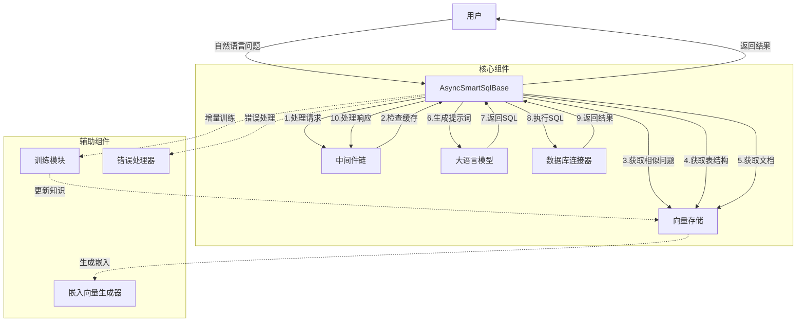
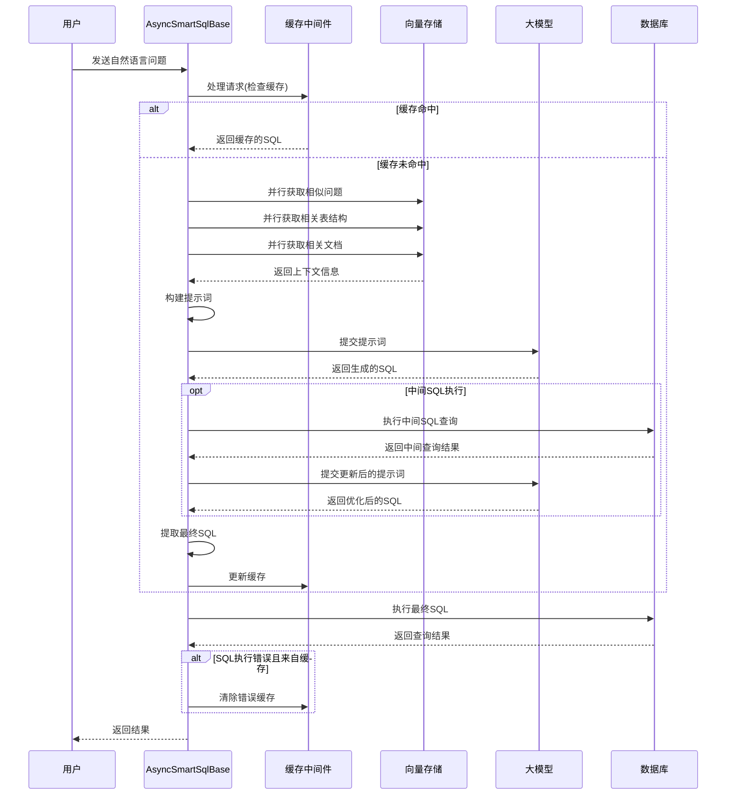
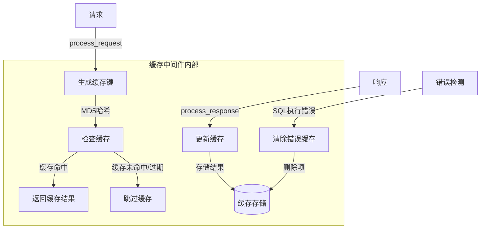

# smart-customer-service-system
构建一个基于大模型的智能客服系统，可提供静态知识问答(静态数据)、动态知识问答（数据库），业务办理（api调用）等功能，同时系统具有自我学习能力。定期的反思可让系统变得更强大。

## 模块介绍

### Text2SQL 智能SQL生成模块

#### 模块简介

Text2SQL是智能客服系统的核心组件之一，负责将自然语言问题转换为准确的SQL查询语句。该模块融合了向量搜索、LLM大模型推理和缓存优化，支持异步处理，具有高效率和可扩展性。

#### 特性

- **自然语言到SQL转换**：通过LLM将问题精准转换为SQL
- **智能上下文理解**：利用相似问题、表结构和文档信息增强推理
- **中间件支持**：可插拔的中间件架构，支持缓存等功能
- **异步处理**：全异步设计，支持高并发场景
- **自学习能力**：支持增量训练和用户反馈
- **错误自愈能力**：自动检测和清除错误缓存
- **模块化设计**：灵活组合各种LLM、向量存储和数据库连接器

#### 详细架构设计

##### 系统组件图



##### 请求处理流程



#### 核心接口设计

##### AsyncLLMProvider 接口

```python
class AsyncLLMProvider:
    """大模型服务提供者异步接口"""
    
    async def submit_prompt(self, prompt, **kwargs):
        """提交提示词到LLM并获取响应
        
        Args:
            prompt: 提示词(字符串或消息列表)
            **kwargs: 附加参数(温度、最大长度等)
            
        Returns:
            LLM响应(通常为文本或结构化数据)
        """
        raise NotImplementedError
```

##### AsyncVectorStore 接口

```python
class AsyncVectorStore:
    """向量存储异步接口"""
    
    async def initialize(self):
        """初始化向量存储"""
        raise NotImplementedError
    
    async def get_similar_question_sql(self, question, top_k=5, **kwargs):
        """获取与问题相似的问题-SQL对
        
        Args:
            question: 查询问题
            top_k: 返回结果数量
            **kwargs: 附加参数
            
        Returns:
            相似问题-SQL对列表
        """
        raise NotImplementedError
    
    async def get_related_ddl(self, question, top_k=3, **kwargs):
        """获取与问题相关的表结构DDL
        
        Args:
            question: 查询问题
            top_k: 返回结果数量
            **kwargs: 附加参数
            
        Returns:
            相关DDL列表
        """
        raise NotImplementedError
    
    async def get_related_documentation(self, question, top_k=3, **kwargs):
        """获取与问题相关的文档
        
        Args:
            question: 查询问题
            top_k: 返回结果数量
            **kwargs: 附加参数
            
        Returns:
            相关文档列表
        """
        raise NotImplementedError
    
    async def add_question_sql(self, question, sql, metadata=None):
        """添加问题-SQL对到向量存储
        
        Args:
            question: 问题文本
            sql: SQL查询
            metadata: 元数据
            
        Returns:
            唯一标识符
        """
        raise NotImplementedError
    
    async def add_ddl(self, ddl, metadata=None):
        """添加表结构定义到向量存储
        
        Args:
            ddl: DDL语句
            metadata: 元数据
            
        Returns:
            唯一标识符
        """
        raise NotImplementedError
    
    async def add_documentation(self, documentation, metadata=None):
        """添加文档到向量存储
        
        Args:
            documentation: 文档内容
            metadata: 元数据
            
        Returns:
            唯一标识符
        """
        raise NotImplementedError
```

##### AsyncDBConnector 接口

```python
class AsyncDBConnector:
    """数据库连接异步接口"""
    
    async def connect(self):
        """建立数据库连接"""
        raise NotImplementedError
    
    async def close(self):
        """关闭数据库连接"""
        raise NotImplementedError
    
    async def run_sql(self, sql, **kwargs):
        """执行SQL查询
        
        Args:
            sql: SQL查询语句
            **kwargs: 附加参数
            
        Returns:
            查询结果(DataFrame或错误信息)
        """
        raise NotImplementedError
```

##### AsyncMiddleware 接口

```python
class AsyncMiddleware:
    """中间件异步接口"""
    
    async def process_request(self, request):
        """处理请求
        
        Args:
            request: 原始请求
            
        Returns:
            处理后的请求
        """
        return request
    
    async def process_response(self, response):
        """处理响应
        
        Args:
            response: 原始响应
            
        Returns:
            处理后的响应
        """
        return response
```

#### 缓存策略详解

缓存中间件采用多级策略确保系统既高效又准确：

1. **键生成策略**: 基于问题+参数的MD5哈希
2. **过期策略**: 支持TTL(时间)和LRU(容量)双重过期机制
3. **一致性保障**: 自动检测错误SQL并清除对应缓存
4. **并发保护**: 使用异步锁保护缓存读写操作
5. **指标跟踪**: 记录命中率等指标以便性能监控



#### 错误处理机制

模块实现了全面的错误处理机制：

1. **SQL执行错误**: 自动检测并清除错误缓存
2. **LLM生成错误**: 捕获并提供明确错误信息
3. **向量检索错误**: 备选策略确保最低限度上下文
4. **数据库连接错误**: 连接池和重试机制
5. **日志跟踪**: 详细记录每个步骤便于调试

#### 性能优化

模块设计中内置多项性能优化：

1. **全异步**: 所有操作采用异步设计提高吞吐量
2. **并行查询**: 同时获取多种上下文信息
3. **缓存机制**: 减少重复大模型调用
4. **token优化**: 动态调整上下文长度避免超出最大token限制
5. **流式返回**: 支持大型结果集的流式返回

#### 使用示例

以下是基于实际项目代码的使用示例：

##### 初始化配置

```python
import asyncio
from text2sql import create_text2sql

# 创建Text2SQL配置
config = {
    "llm": {
        "type": "qwen",  # 使用千问大模型
        "api_key": "your_api_key_here",
        "base_url": "https://dashscope.aliyuncs.com/compatible-mode/v1",
        "model": "qwen2.5-72b-instruct"  # 使用千问2.5-72B模型
    },
    "storage": {
        "type": "chromadb",  # 使用ChromaDB向量数据库
        "host": "localhost",
        "port": 8000,
        "n_results": 5,  # 默认返回相似结果数量
        "hnsw_config": {
            "M": 16,                  # 每个节点的最大出边数
            "construction_ef": 100,   # 建立索引时考虑的邻居数
            "search_ef": 50,          # 查询时考虑的邻居数
            "space": "cosine"         # 向量空间距离计算方式
        }
    },
    "db": {
        "type": "postgresql",  # 使用PostgreSQL数据库
        "host": "localhost",
        "port": 5432,
        "database": "your_database",
        "user": "your_username",
        "password": "your_password",
        "min_size": 2,  # 连接池最小连接数
        "max_size": 5   # 连接池最大连接数
    },
    "middlewares": [
        {"type": "cache", "max_size": 100, "ttl": 3600}  # 缓存中间件配置
    ],
    "dialect": "PostgreSQL",  # SQL方言
    "language": "zh",         # 处理语言
    "embedding": {
        "type": "qwen",  # 使用千问嵌入模型
        "api_key": "your_api_key_here",
        "base_url": "https://dashscope.aliyuncs.com/compatible-mode/v1",
        "embedding_model": "text-embedding-v3"
    }
}

# 异步方式创建Text2SQL实例
async def init_text2sql():
    # 创建实例
    text2sql = await create_text2sql(config)
    return text2sql

# 运行初始化
text2sql = asyncio.run(init_text2sql())
```

##### 基本使用方法

```python
import asyncio

# 1. 直接生成SQL (不执行)
async def generate_sql_example():
    question = "查询最近30天的销售数据"
    sql = await text2sql.generate_sql(question)
    print(f"生成的SQL: {sql}")
    return sql

# 2. 生成并执行SQL
async def ask_example():
    question = "统计各个产品类别的销售总额"
    result = await text2sql.ask(question)
    
    print(f"生成的SQL: {result['sql']}")
    
    # 检查结果
    if isinstance(result['data'], dict) and result['data'].get('error'):
        print(f"执行错误: {result['data']['message']}")
    else:
        print(f"查询结果: {result['data']}")
    
    return result

# 运行示例
sql = asyncio.run(generate_sql_example())
result = asyncio.run(ask_example())
```

##### 训练与知识更新

```python
import asyncio

async def train_example():
    # 准备训练数据
    training_data = [
        # 添加表结构定义
        {
            'ddl': '''
            CREATE TABLE sales (
                id SERIAL PRIMARY KEY,
                product_id INTEGER NOT NULL,
                amount DECIMAL(10, 2) NOT NULL,
                sale_date TIMESTAMP NOT NULL,
                customer_id INTEGER,
                region TEXT
            );
            
            CREATE TABLE products (
                id SERIAL PRIMARY KEY,
                name TEXT NOT NULL,
                category TEXT NOT NULL,
                price DECIMAL(10, 2) NOT NULL
            );
            '''
        },
        
        # 添加示例问题-SQL对
        {
            'question': '查询最近一周每个分类的销售额',
            'sql': '''
            SELECT p.category, SUM(s.amount) as total_sales
            FROM sales s
            JOIN products p ON s.product_id = p.id
            WHERE s.sale_date >= NOW() - INTERVAL '7 days'
            GROUP BY p.category
            ORDER BY total_sales DESC;
            '''
        },
        
        # 添加业务文档
        {
            'documentation': '''
            销售数据说明:
            - sales表存储所有销售记录
            - sale_date是销售时间戳
            - amount是销售金额
            - region可以是: 'North', 'South', 'East', 'West'
            '''
        }
    ]
    
    # 提交训练
    result = await text2sql.train(training_data=training_data, source="manual")
    print(f"训练结果: {result}")
    
    # 查看成功和失败项目
    print(f"成功条目: {len(result['success'])}")
    print(f"失败条目: {len(result['failed'])}")
    
    return result

# 运行训练示例
asyncio.run(train_example())
```

##### 完整工作流示例

```python
import asyncio
from text2sql import create_text2sql

async def text2sql_workflow():
    # 1. 初始化
    text2sql = await create_text2sql(config)
    
    # 2. 添加知识
    await text2sql.train([
        {'ddl': 'CREATE TABLE users (id INTEGER PRIMARY KEY, name TEXT, email TEXT)'}
    ])
    
    # 3. 生成SQL
    sql = await text2sql.generate_sql("查询所有用户的邮箱地址")
    print(f"生成的SQL: {sql}")
    
    # 4. 执行查询
    result = await text2sql.ask("有多少用户的邮箱是gmail.com结尾的?")
    print(f"SQL: {result['sql']}")
    print(f"结果: {result['data']}")
    
    # 5. 关闭资源
    await text2sql.shutdown()

# 运行工作流
if __name__ == "__main__":
    asyncio.run(text2sql_workflow())
```

#### 配置选项

| 参数 | 说明 | 默认值 |
|------|------|--------|
| dialect | SQL方言 | "SQL" |
| language | 处理语言 | None |
| max_tokens | 最大token数 | 14000 |
| initial_prompt | 初始提示词 | 根据dialect自动生成 |

#### 缓存中间件配置

| 参数 | 说明 | 默认值 |
|------|------|--------|
| ttl | 缓存过期时间(秒) | 3600 |
| max_size | 最大缓存条目数 | 100 |

#### 错误处理与缓存机制

系统会自动检测SQL执行结果，当发现缓存的SQL执行错误时，会自动清除相应缓存，避免错误持续影响用户：

```python
# 自动错误检测和缓存清理
result = await text2sql.ask("查询用户数据")
if result.get('error'):
    print(f"查询错误: {result['error']}")
```

#### 自定义扩展

可以通过实现相应接口来扩展系统功能：

- 实现`AsyncLLMProvider`接口添加新的LLM服务
- 实现`AsyncVectorStore`接口添加新的向量存储
- 实现`AsyncDBConnector`接口支持新的数据库类型
- 实现`AsyncMiddleware`接口添加新的中间件功能

#### 实现挑战与解决方案

| 挑战 | 解决方案 |
|------|----------|
| SQL语法错误 | 多轮校验+历史成功案例引导 |
| 上下文长度限制 | 动态调整上下文+相关性排序 |
| 缓存一致性 | 错误自动清除+TTL过期 |
| 大模型依赖 | 接口抽象+多模型支持 |
| 扩展性 | 插件架构+中间件机制 |

#### 未来扩展方向

1. **更丰富的LLM模型支持**: 集成更多开源和闭源大模型
2. **自动模式推导**: 根据提问自动推断数据库模式
3. **多数据源支持**: 支持跨数据库查询
4. **自动代理决策**: 让系统自动决定是否需要生成SQL或使用其他解决方案
5. **查询分析与优化**: 分析生成的SQL并提供性能优化建议
