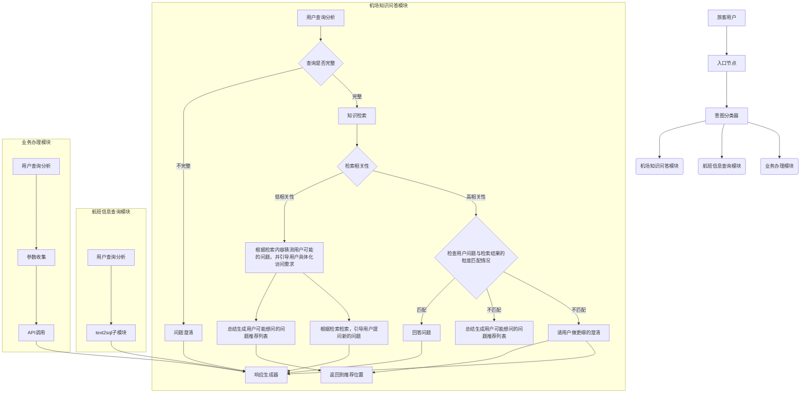
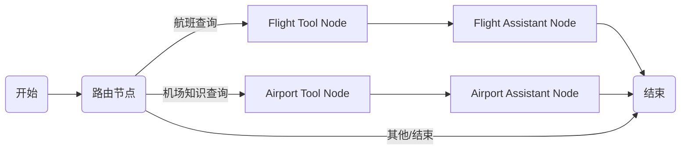

# 智能机场客服系统

## 项目概述

智能机场客服系统是一个基于LangGraph构建的智能问答系统，专门为济南遥墙国际机场(TNA)设计。系统能够智能识别用户意图，并提供航班信息查询和机场知识检索服务，为旅客提供便捷、准确的信息服务。

## 系统架构

系统基于LangGraph构建，采用图形化工作流结构，主要包含以下组件：

### 核心组件

- **主图(Airport Service Graph)**: 定义整个工作流程，包括节点定义、边定义和状态管理
- **路由节点(Router)**: 负责识别用户意图，将请求路由到相应的专业节点
- **航班信息节点(Flight)**: 处理所有航班相关的查询请求
- **机场知识节点(Airport)**: 处理关于机场服务、规定和流程的咨询

### 技术栈

- **LangGraph**: 构建工作流和状态管理
- **LangChain**: 基础组件库
- **Text2SQL**: 自然语言转SQL查询组件，用于航班信息查询
- **Text2KB**: 知识库检索组件，用于机场知识查询
- **SQLite/PostgreSQL**: 用于持久化存储对话状态和图结构

## 功能特性

系统提供以下主要功能：

1. **航班信息查询**：
   - 航班状态查询（起飞/到达/延误等）
   - 航班时刻表查询
   - 特定航班的详细信息

2. **机场知识查询**：
   - 安全检查服务：安检区域、安检须知
   - 出行服务：爱心服务、服务电话、贵宾室服务、头等舱休息室服务、晚到服务
   - 行李服务：托运须知、行李打包、行李寄存、行李赔偿、行李逾重须知
   - 值机服务：团队预约、值机区域、自助办理、自助值机
   - 中转服务

3. **多轮对话支持**：系统支持上下文感知的多轮对话，能够根据对话历史理解用户的后续问题

## 图结构示意

整体的业务架构图



系统基于LangGraph构建的工作流图结构如下：


主要节点功能：
- **Router**: 路由节点，分析用户意图并选择合适的处理路径
- **Flight Tool Node**: 航班工具节点，调用Text2SQL转换用户问题为SQL查询，获取航班数据
- **Flight Assistant Node**: 航班助手节点，基于查询结果生成用户友好的回答
- **Airport Tool Node**: 机场工具节点，从知识库检索相关信息
- **Airport Assistant Node**: 机场助手节点，根据检索结果生成答案

系统使用条件边和状态管理，实现了完整的对话流程控制和上下文保持。

## 快速开始

### 环境要求

### 环境要求

- Python 3.12+
- 依赖库：见`pyproject.toml`文件

### 安装步骤

1. 克隆项目并进入项目目录
```bash
git clone [repository-url]
cd smart-customer-service-system
```

2. 使用uv创建虚拟环境并安装依赖
```bash
uv sync
```

这样就使用uv替代了传统的venv和pip命令，保持了项目的其他安装流程不变。
```

3. 配置环境变量
```bash
cp .env.example .env
# 编辑.env文件，填入必要的API密钥和配置
```

### 运行系统

```bash
python main.py
```

## 系统结构

```
smart-customer-service-system/
├── agents/                      # 代理模块（核心功能）
│   └── airport_service/         # 机场服务代理
│       ├── graph_compile.py     # 图编译和管理
│       ├── main_graph.py        # 主图定义
│       ├── state.py             # 状态定义
│       ├── nodes/               # 节点定义
│       │   ├── airport.py       # 机场知识节点
│       │   ├── flight.py        # 航班信息节点
│       │   └── router.py        # 路由节点
│       └── tools/               # 工具定义
│           ├── airport.py       # 机场知识工具
│           └── flight.py        # 航班信息工具
├── common/                      # 通用组件
├── config/                      # 配置管理
├── data/                        # 数据存储
├── logs/                        # 日志文件
├── text2kb/                     # 知识库检索模块
├── text2sql/                    # 自然语言转SQL模块
├── tools/                       # 工具集
├── .env.example                 # 环境变量示例
├── main.py                      # 主入口文件
├── main_graph.png               # 图结构可视化
└── pyproject.toml               # 项目依赖配置
```

## 工作流程

1. 用户发送问题
2. 路由节点分析用户意图
3. 根据意图调用相应的专业工具（航班查询或机场知识查询）
4. 专业节点处理用户问题并生成回答
5. 系统返回结果给用户


### 配置管理

系统配置存储在`.env`文件中，主要包括以下几类配置：

#### LLM配置
```
LLM_TYPE=siliconflow                           # LLM服务提供商
LLM_API_KEY=sk-your-api-key                    # LLM API密钥
LLM_BASE_URL=https://api.siliconflow.cn/v1     # LLM API基础URL
LLM_MODEL=Qwen/Qwen2.5-72B-Instruct            # 使用的大语言模型
LLM_TEMPERATURE=0.7                            # 温度参数（创造性）
LLM_MAX_TOKENS=20000                           # 最大令牌数
```

#### 嵌入模型配置
```
EMBEDDING_TYPE=siliconflow                     # 嵌入模型提供商
EMBEDDING_API_KEY=sk-your-embedding-api-key    # 嵌入模型API密钥
EMBEDDING_BASE_URL=https://api.siliconflow.cn/v1 # 嵌入模型API基础URL
EMBEDDING_MODEL=BAAI/bge-large-zh-v1.5         # 使用的嵌入模型
EMBEDDING_DIMENSIONS=1024                      # 嵌入维度
EMBEDDING_MAX_TOKENS=512                       # 最大令牌数
```

#### 数据库配置
```
DB_TYPE=postgresql                             # 数据库类型
DB_DATABASE=your_database_name                 # 数据库名称
DB_HOST=localhost                              # 数据库主机
DB_PORT=5432                                   # 数据库端口
DB_USER=your_username                          # 数据库用户名
DB_PASSWORD=your_password                      # 数据库密码
DB_MIN_SIZE=2                                  # 连接池最小大小
DB_MAX_SIZE=5                                  # 连接池最大大小
```

#### 向量数据库配置
```
STORAGE_TYPE=chromadb                          # 向量存储类型
CHROMA_HOST=localhost                          # ChromaDB主机
CHROMA_PORT=7996                               # ChromaDB端口
CHROMA_N_RESULTS=5                             # 检索结果数量
```

#### 知识库配置
```
KB_ADDRESS=localhost:9380                      # 知识库API地址
KB_API_KEY=your-kb-api-key                     # 知识库API密钥
```

#### Text2SQL配置
```
DIALECT=PostgreSQL                             # SQL方言
LANGUAGE=zh                                    # 语言（中文）
```

#### 日志配置
```
LOG_LEVEL=DEBUG                                # 日志级别
LOG_DIR=logs                                   # 日志目录
LOG_MAX_BYTES=10485760                         # 单个日志文件最大大小
LOG_BACKUP_COUNT=5                             # 保留的日志文件数量
```

## 贡献指南

欢迎贡献代码，请遵循以下步骤：
1. Fork项目
2. 创建功能分支
3. 提交更改
4. 创建Pull Request

## 许可证

[添加许可证信息]
