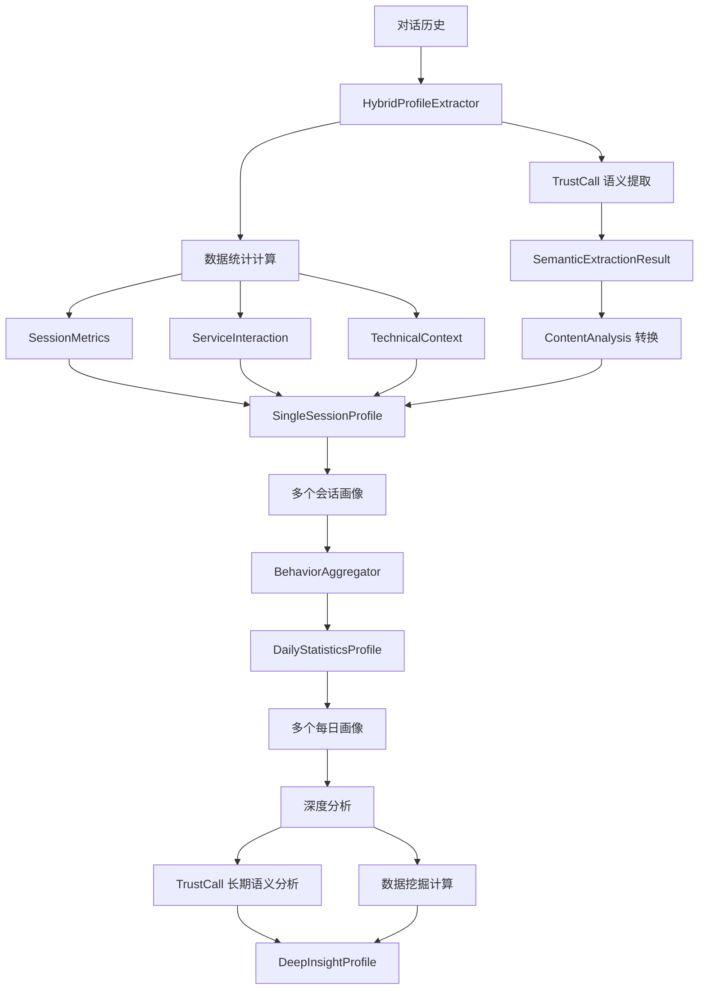

# 混合式用户画像提取架构设计

## 📋 设计理念

根据您的反馈，我们重新设计了用户画像提取架构，采用 **TrustCall 语义提取 + 数据统计计算** 的混合模式：

- **TrustCall**: 仅用于提取需要语义理解的信息（情感、意图、关注点等）
- **数据分析**: 用于统计、计算、聚合等可以通过数据处理得出的指标
- **混合提取**: 结合两者优势，确保画像的准确性和完整性

## 🏗️ 架构组件

### 1. 语义提取组件 (TrustCall)

#### `SemanticExtractionResult`
```python
# 仅提取需要语义理解的信息
- language: 语言识别
- query_style: 提问风格分析
- sentiment: 情感倾向
- anxiety_level: 焦虑程度评估
- primary_concerns: 关注点识别
- pain_points: 痛点分析
- inferred_traveler_type: 旅客类型推断
```

#### `LongTermSemanticAnalysis`
```python
# 长期语义趋势分析
- communication_style_evolution: 沟通风格演变
- concern_shift_patterns: 关注点变化
- core_needs: 核心需求识别
- personalization_recommendations: 个性化建议
```

### 2. 数据分析组件

#### `SessionMetricsCalculator` - 会话指标计算
```python
# 纯数据计算
- 会话时长、轮次统计
- 消息数量统计
- 响应时间计算
- 时间戳处理
```

#### `DataProfileAnalyzer` - 数据画像分析
```python
# 基于规则和模式匹配
- 技术环境提取
- 服务交互分析
- 航班/路线/航司提取
- 知识领域识别
- 价值指标计算
```

#### `BehaviorAggregator` - 行为聚合
```python
# 统计聚合
- 每日交互指标计算
- 行为模式统计
- 服务使用统计
- 长期趋势分析
```

### 3. 混合提取器

#### `HybridProfileExtractor`
```python
class HybridProfileExtractor:
    def __init__(self):
        # TrustCall 语义提取器
        self.semantic_extractor = create_extractor(...)
        
        # 数据分析组件
        self.data_analyzer = DataProfileAnalyzer()
        self.session_calculator = SessionMetricsCalculator()
        self.behavior_aggregator = BehaviorAggregator()
```

## 🔄 三步走流程

### 第一步：会话画像提取
```python
async def extract_session_profile(self, ...):
    # 1. TrustCall 提取语义信息
    semantic_result = await self._extract_semantic_info(conversation_history)
    
    # 2. 计算会话统计指标
    session_metrics = self.session_calculator.calculate_session_metrics(...)
    
    # 3. 分析服务交互
    service_interaction = self.data_analyzer.analyze_service_interaction(...)
    
    # 4. 组装完整画像
    return SingleSessionProfile(...)
```

### 第二步：每日聚合画像
```python
async def extract_daily_profile(self, ...):
    # 完全基于数据统计
    interaction_metrics = self.behavior_aggregator.calculate_daily_interaction_metrics(...)
    behavior_pattern = self.behavior_aggregator.analyze_daily_behavior_pattern(...)
    service_usage = self.behavior_aggregator.analyze_daily_service_usage(...)
    
    return DailyStatisticsProfile(...)
```

### 第三步：深度洞察分析
```python
async def extract_deep_insight(self, ...):
    # 1. TrustCall 长期语义分析
    semantic_analysis = await self._extract_longterm_semantic_analysis(...)
    
    # 2. 数据挖掘和统计
    behavior_pattern = self.behavior_aggregator.analyze_longterm_behavior_pattern(...)
    travel_pattern = self.data_analyzer.analyze_travel_pattern(...)
    value_score, retention_risk, upsell_potential = self.data_analyzer.calculate_value_metrics(...)
    
    return DeepInsightProfile(...)
```

## 📊 数据流示意



## 🎯 核心优势

### 1. **职责清晰**
- TrustCall: 专注语义理解
- 数据分析: 专注统计计算
- 各司其职，避免混淆

### 2. **准确性提升**
- 语义信息通过 LLM 准确提取
- 统计指标通过算法精确计算
- 避免用 AI 做简单计算的错误

### 3. **性能优化**
- 减少不必要的 LLM 调用
- 大部分指标通过本地计算获得
- 提高处理速度和稳定性

### 4. **可维护性**
- 组件模块化设计
- 易于测试和调试
- 便于功能扩展

## 🔧 使用示例

### 触发会话画像提取
```python
# 通过 memory_manager 触发
result = await memory_manager.trigger_session_profile_extraction(
    application_id="airport_service",
    user_id="user_001",
    run_id="session_001"
)

# 内部调用混合提取器
extractor = hybrid_profile_extractor
session_profile = await extractor.extract_session_profile(...)
```

### 每日聚合
```python
# 完全基于统计
daily_profile = await extractor.extract_daily_profile(
    user_id="user_001",
    date="2024-12-01",
    session_profiles=session_list
)
```

### 深度分析
```python
# 语义分析 + 数据挖掘
deep_profile = await extractor.extract_deep_insight(
    user_id="user_001",
    daily_profiles=daily_list,
    analysis_period="30天"
)
```

## 📈 效果预期

1. **提取准确性**: TrustCall 专注语义，避免误判
2. **计算效率**: 统计指标本地计算，响应快速
3. **成本控制**: 减少不必要的 LLM 调用
4. **扩展性**: 组件化设计，易于添加新功能

## 🔮 未来扩展

1. **规则引擎**: 增强数据分析组件的规则配置
2. **机器学习**: 在统计分析中引入 ML 模型
3. **实时分析**: 支持流式数据处理
4. **多模态**: 支持图片、语音等多模态输入

---

这个新架构完全符合您提出的设计理念：**TrustCall 负责语义，数据分析负责统计，两者结合形成完整画像**。
