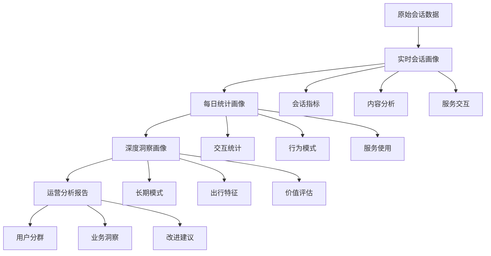

# 智能客服用户画像系统设计文档

## 系统概述

基于大模型的智能客服系统用户画像系统，采用三步走战略，从实时会话分析到长期行为洞察，为机场运营提供全方位的用户理解和业务优化支持。

## 三步走战略架构

### 第一步：实时会话画像 (Single Session Profile)
- **触发时机**: 当次会话结束后（长时间无输入或前端主动触发）
- **数据来源**: 单次会话的所有交互数据
- **主要功能**: 从非结构化对话中提取用户当次行为特征

### 第二步：每日统计画像 (Daily Statistics Profile)  
- **触发时机**: 每天定时触发（默认凌晨1点）
- **数据来源**: 当天所有会话画像的聚合
- **主要功能**: 形成用户日常行为模式和偏好统计

### 第三步：深度洞察画像 (Deep Insight Profile)
- **触发时机**: 定期触发（默认每周一）
- **数据来源**: 长周期的每日画像数据综合分析
- **主要功能**: 深层用户标签、价值评估、个性化策略

## 核心模型设计

### 画像层次结构



### 用户标签体系

#### 基础标签
- **旅客类型**: 商旅人士、休闲旅客、首次乘机、常旅客、家庭出行、学生出行、中转旅客
- **用户角色**: 乘机人本人、亲友代问、接送机人员、代理人、机场工作人员
- **消费能力**: 高价值客户、中等消费、价格敏感、未知

#### 行为标签
- **提问风格**: 简洁型、详细型、紧急型、随意型、专业型
- **情感状态**: 积极、中性、消极、焦虑、满意
- **服务偏好**: 自助服务倾向、人工服务偏好、创新服务接受度

#### 业务标签
- **出行频率**: 高频、中频、低频
- **航司偏好**: 基于查询和使用历史
- **服务需求**: 特殊服务、增值服务使用情况
- **价值评估**: 客户价值分数、流失风险、增值潜力

## 技术实现架构

### 系统组件

1. **画像模型层** (`user_profile_model.py`, `user_profile_model_extended.py`)
   - 定义所有画像数据结构
   - 枚举类型和验证规则
   - 向后兼容性支持

2. **画像提取器** (`profile_extractor.py`)
   - `SessionProfileExtractor`: 会话画像提取
   - `DailyStatisticsExtractor`: 每日统计聚合
   - `DeepInsightExtractor`: 深度洞察分析
   - `ProfileOrchestrator`: 整体编排协调

3. **调度系统** (`profile_scheduler.py`)
   - 自动化触发机制
   - 并发控制和错误处理
   - 监控和状态管理

4. **运营分析** (`operational_analytics.py`)
   - 业务指标计算
   - 用户分群分析
   - 报告生成和洞察

### 关键算法

#### 情感分析算法
```python
def analyze_sentiment(text: str) -> Sentiment:
    sentiment_keywords = {
        Sentiment.POSITIVE: ["满意", "好的", "谢谢", "不错", "棒"],
        Sentiment.NEGATIVE: ["不满", "糟糕", "失望", "烦", "差"],
        Sentiment.ANXIOUS: ["急", "赶时间", "担心", "焦虑", "紧张"],
        # ...
    }
    # 基于关键词匹配和权重计算
```

#### 用户价值评估
```python
def calculate_value_score(profiles: List[DailyStatisticsProfile]) -> float:
    # 综合考虑：活跃度 + 忠诚度 + 消费潜力
    total_sessions = sum(p.interaction_metrics.total_sessions for p in profiles)
    avg_satisfaction = sum(p.service_usage.satisfaction_rate for p in profiles) / len(profiles)
    days_span = len(profiles)
    
    value_score = (total_sessions/50 + avg_satisfaction + days_span/30) / 3
    return min(value_score, 1.0)
```

## 部署和集成

### 环境要求
```toml
# pyproject.toml 依赖
dependencies = [
    "pydantic>=2.0.0",
    "asyncio",
    "apscheduler>=3.10.0",
    "datetime",
    "typing_extensions"
]
```

### 初始化系统
```python
from agents.airport_service.context_engineering.profile_scheduler import ProfileScheduler, ScheduleConfig
from agents.airport_service.context_engineering.profile_scheduler import ProfileAPI

# 创建配置
config = ScheduleConfig(
    daily_aggregation_time="01:00",
    deep_analysis_day=0,  # 周一
    session_timeout_minutes=30
)

# 初始化系统
scheduler = ProfileScheduler(config)
api = ProfileAPI(scheduler)

# 启动调度器
scheduler.start()
```

### API使用示例

#### 跟踪用户消息
```python
await api.track_message(
    user_id="user_123",
    session_id="session_456", 
    message_data={
        "role": "user",
        "content": "我想查询航班信息",
        "timestamp": "2024-01-01T10:00:00",
        "technical_context": {
            "device": "mobile",
            "source": "wechat",
            "location": "北京"
        }
    }
)
```

#### 触发会话结束
```python
result = await api.trigger_session_end("user_123", "session_456")
```

#### 手动触发画像更新
```python
# 每日更新
daily_result = await api.manual_daily_update("user_123", "2024-01-01")

# 深度分析
deep_result = await api.manual_deep_analysis("user_123", days=30)
```

## 运营应用场景

### 1. 实时服务优化
- **场景**: 会话进行中识别用户类型和情感状态
- **应用**: 动态调整回复策略，匹配合适的服务方式
- **价值**: 提升用户体验，减少升级到人工的比例

### 2. 个性化推荐
- **场景**: 基于用户画像推荐相关服务
- **应用**: 主动推送个性化信息，精准营销
- **价值**: 增加服务使用率，提升客户价值

### 3. 用户分群运营
- **场景**: 识别不同价值用户群体
- **应用**: 差异化服务策略，精准投放资源
- **价值**: 提高运营效率，优化资源配置

### 4. 流失预警
- **场景**: 识别有流失风险的用户
- **应用**: 主动关怀，挽留措施
- **价值**: 提高用户留存率，降低获客成本

### 5. 服务改进
- **场景**: 分析用户痛点和需求
- **应用**: 优化服务流程，开发新功能
- **价值**: 持续改进用户体验，提升竞争力

## 运营指标体系

### 核心KPI
- **用户活跃度**: 日活跃用户数、月活跃用户数
- **服务质量**: 问题解决率、平均响应时间、用户满意度
- **业务价值**: 客户价值分数、留存率、转化率

### 分群指标
- **高价值商旅客户**: 14.4%，平均满意度89%
- **常旅客**: 25.6%，忠诚度分数0.72
- **首次用户**: 33.6%，增长潜力85%
- **家庭客户**: 12.0%，特殊服务使用率高
- **价格敏感用户**: 14.4%，需要成本优化策略

### 趋势分析
- **用户增长趋势**: 新用户占比、留存曲线
- **服务使用趋势**: 热门服务排行、使用频率变化
- **满意度趋势**: 时间序列分析、影响因素识别

## 数据隐私和安全

### 数据脱敏
- 个人身份信息Hash处理
- 位置信息模糊化到城市级别
- 敏感内容过滤和替换

### 访问控制
- 分级权限管理
- 数据使用审计日志
- 定期权限回收

### 合规要求
- 符合数据保护法规
- 用户同意机制
- 数据删除和导出权利

## 系统监控

### 性能监控
- 画像提取延迟
- 系统吞吐量
- 资源使用率

### 质量监控
- 画像准确率
- 数据完整性
- 一致性检查

### 业务监控
- 画像覆盖率
- 更新及时性
- 应用效果评估

## 扩展和优化

### 短期优化
1. **提升画像精度**: 优化特征提取算法，增加训练数据
2. **减少处理延迟**: 优化并发处理，增加缓存机制
3. **丰富画像维度**: 增加新的行为特征和业务标签

### 长期发展
1. **机器学习增强**: 引入深度学习模型，自动特征学习
2. **实时流处理**: 升级为流式计算架构，支持实时画像更新
3. **多模态融合**: 整合文本、语音、图像等多种数据源

## 故障处理

### 常见问题
1. **画像提取失败**: 检查数据格式，查看错误日志
2. **调度任务异常**: 验证Cron表达式，检查资源限制
3. **性能下降**: 监控并发数，优化数据库查询

### 应急预案
1. **服务降级**: 关闭非关键功能，保证核心流程
2. **数据恢复**: 从备份恢复画像数据
3. **手动干预**: 提供手动触发接口，绕过自动化流程

## 结论

本用户画像系统通过三步走战略，实现了从实时感知到深度洞察的完整用户理解体系。系统不仅支持实时的服务优化，还能为机场运营提供长期的战略指导。通过持续的数据积累和算法优化，系统将不断提升用户体验和运营效率。

---

*最后更新: 2024年12月*
